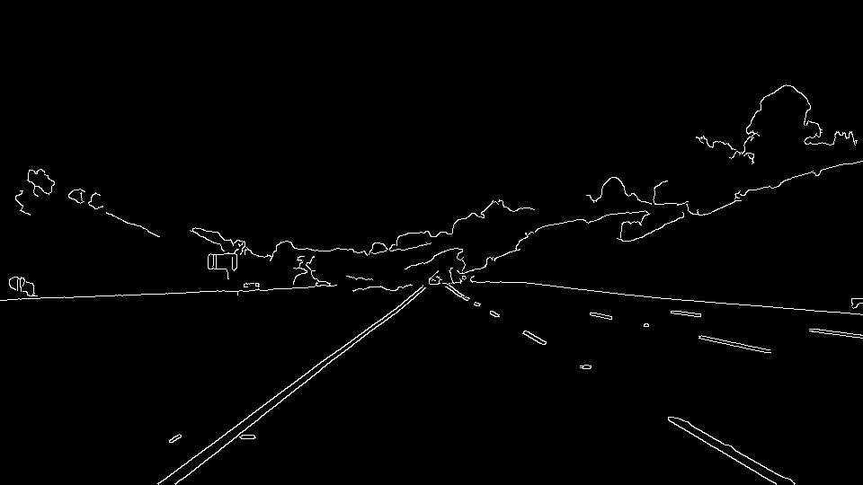

### **Finding Lane Lines on the Road** 

## Writeup

The purpose of this project is to take in a video stream and add lines to it that corresponds to the lines on the road

## Reflection

#### 1. The pipeline

The original image:

I convert the image to grayscale

Blur the image using guassian blur.  This removes impurities that impeads edge detection.

Apply canny edge detection to the image.  This finds all the hard edges in the images.

Limit the image to the are that I'm interested in.

Find the Hough Lines of the image.

Remove the Hough Lines that are sloped incorrectly, and find two lines that best approximates the Hough Lines. The longer the Hough Line, the higher weight it carries in the approximation.

Apply the two fitting lines to the original image

#### 2. Shortcomings
There are multiple glaring shortcomings, which include:
* If the dashed lines are too far apart, it doesn't work.
* The curb can sometimes be registered as a line.
* If the image isn't centered correctly, the cropped region is incorrect.
* If the contrast between the line and the road isn't enough, then it doesn't pick up a line.
* A curved line is approximated with a straight line (obviously not ideal).

#### 3. Possible Improvements
* Fiddle with the Canny Edge and Hough Line constants.
* Find a better way to approximate a fitted line from the Hough Lines (like least sqaures).
* Dynamically adjust the area of concern.
* Do not allow a drastic change from one frame to the next.
